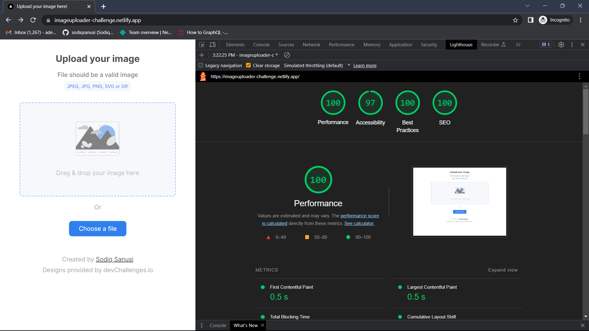

# Dev Challenges - Image Uploader fullstack application

This is a solution to the [Image Uploader challenge on devChallenges](https://devchallenges.io/challenges/O2iGT9yBd6xZBrOcVirx).
## Table of contents

- [Overview](#overview)
  - [The challenge](#the-challenge)
  - [Screenshot](#screenshot)
  - [Links](#links)
- [My process](#my-process)
  - [Built with](#built-with)
  - [What I learned](#what-i-learned)
  - [Continued development](#continued-development)
  - [Useful resources](#useful-resources)
- [Author](#author)
- [Acknowledgments](#acknowledgments)

## Overview

The overall goal of the challenge was to build both the frontend and the backend of an application where users can access the frontend interface to upload images from their device, providing them with a unique link that can be used to retrieve the image they uploaded.

### The challenge

Users should be able to:

- Drag and drop an image to upload it
- Choose to select an image from a folder
- See a loader while their image is being uploaded
- See a preview of the image they uploaded after upload has been successful
- Copy a link of their image to their clipboard

### Screenshot

### Links

- Solution URL: [https://github.com/sodiqsanusi/multi-step-form/](https://github.com/sodiqsanusi/image-uploader/)
- Live Site URL: [https://imageuploader-challenge.netlify.app/](https://imageuploader-challenge.netlify.app/)

## My process

> DISCLAIMER: this is the first fullstack application I'm building, so process was quite chaotic

Decided to start with building the backend of the application
1. Set up an Express application, and made necessary configuration to connect to a remote mongoDB cluster.
2. Researched on best ways of incorporating file upload in Express apps, and decided to use Multer (a package).
3. Set up routes, multer middleware for file upload, and controller functions for each route.
4. Did some validation on the backend to prevent upload of non-image files and files above 1MB to the database (_I knew I'll do another validation on the frontend, but then, can't be too safe right?_).
5. Set up documentations of the API on Postman, with examples on individual routes and necessary requirements for a successful response.
6. Hosted the backend on Render, tested the live APIs on Postman again (_thankfully, there were no issues at this point_).

At this point, I felt I was majorly done with the backend (lol), and started with the frontend interface. This was pretty routine, so I won't bore you with it.

Saw (~~shege~~) learning opportunities🙂 when I wanted to use the backend APIs in the frontend application. Apparently, I didn't know about CORS and was getting lots of errors due to that.

In summary, I actually had lots of issues building this out—majorly due to my lack of experience in building fullstack applications, and I'm just excited that I was able to solve these issues myself while building the app.

### Built with

#### Backend
- [Express](https://expressjs.com/) - Backend framework built on Node.js
- [Mongoose](https://mongoosejs.com/) - An ODM that makes it easier to communicate with mongoDB databases
- [Multer](https://www.npmjs.com/package/multer) - A node.js middleware for handling file uploading

#### Frontend
- Mobile-first workflow
- [Next.js](https://nextjs.org/) - React framework
- CSS Modules

### What I learned

If i decide to give details here, it will really take a long while😭.

A short abridged version anyways. While building this application, I:

- Learnt on how to handle file uploads both on the backend and on frontend.
- Got more knowledge on how to save files uploaded to a backend, and on factors to consider when choosing a method.
- Understood firsthand the benefits of documenting your backend APIs.
- Knew about CORS, how it protects a backend service and on how to implement its headers to allow the right origin to access your APIs.
- Handled drag-and-drop functionality in an interface for the first time.
- _More stuff that I've forgotten about..._

### Continued development

Well, one of the reasons I really wanted to build this application was to have something to at least, show as evidence to my claims of knowing about "backend technologies" and having the technical know-how on building fullstack applications. And I'll love to build more "evidences".

There's this quite complex fullstack application I saw, so I'm planning to try building it out soon🤞🏾

### Useful resources

- [How to Implement the Drag-and-Drop of Files in React](https://betterprogramming.pub/how-to-implement-files-drag-and-drop-in-react-22cf42b7a7ef) - The title is self-explanatory right?😅
- [Complete Guide to CORS](https://reflectoring.io/complete-guide-to-cors/) - This article was really detailed in its explanation of CORS, very helpful in helping me understand what the protocol does.
- [How to use CORS in Node.js with Express](https://www.section.io/engineering-education/how-to-use-cors-in-nodejs-with-express/) - A straightforward resource that helps illustrate on how to use CORS in Express apps.

## Author

- Twitter - [@sodiqsanusi_](https://www.twitter.com/sodiqsanusi_)

## Acknowledgments

Grateful to the CS undergrads I have around me as friends.

Apart from them making me feel less like an imposter, I sincerely owe a lot to them. Hopefully I get to make it up to you guys.
